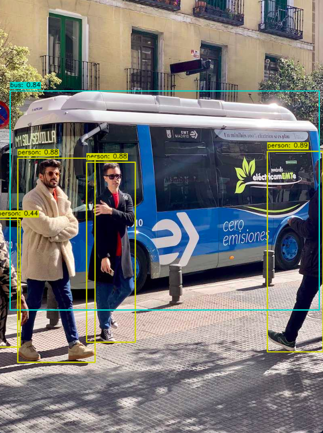

<h3 align="center">Yolov8 Tflite C++</h3>

## About The Project

Object detection in c++ using the a yolov8 tflite model based on the python implementation. 
>br>
<br>


## Requirements

OpenCV and Tensorflow

Tested with tflite v2.14 and 


### Getting Started

1. Update path to tensorflow and flatbuffer headers and lib

2. Clone the repo
   ```
   mkdir build; cd build
   cmake -B . -S ..
   make
   ```

3. Run
```
./Yolov8CppInference
```

The program outputs the photo with the bounding boxes around the detected objects their ids and score. 



<br>

## Acknowledgments

* [Thanks to Ultralytics](https://github.com/ultralytics/ultralytics)


